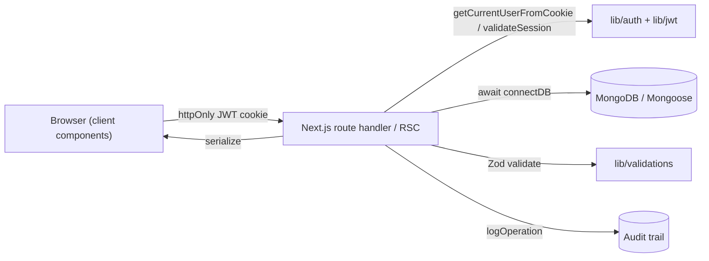
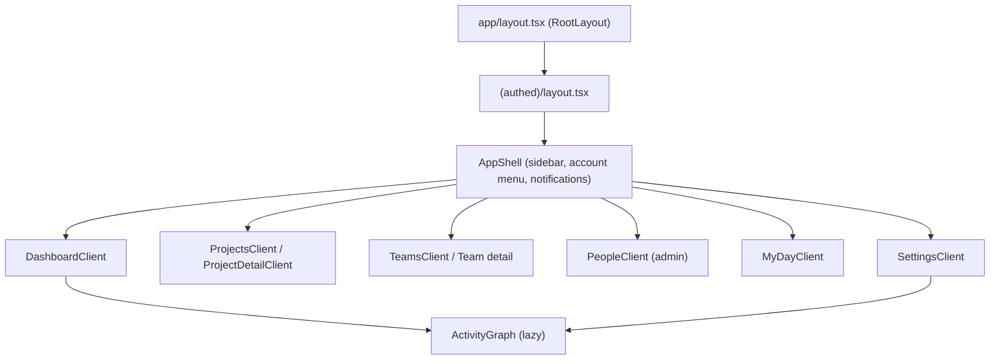

# Architecture

A high-level map of Pragati for reviewers. For the immutable constraints behind
these choices, see `CLAUDE.md`.

## Stack

- **Next.js 14** (App Router, React Server Components) + **TypeScript**
- **Tailwind CSS** for styling
- **MongoDB** via **Mongoose** (`src/models/*`, cached connection in
  `src/lib/db.ts`)
- **Custom auth** — JWT + bcrypt + httpOnly cookies (`src/lib/auth.ts`,
  `jwt.ts`, `password.ts`). No third-party identity provider.
- **Deterministic QA triage** — rule-based engine (`src/lib/ai/*`), no LLM in
  the scoring path.

## Request / data flow



- **Reads:** server components call `lib/*` data builders
  (`leadDashboard.ts`, `projectDetail.ts`, `contributions.ts`) directly against
  Mongoose and pass serialized props into client components for first paint.
- **Mutations:** client `api()` calls hit `/api/**` route handlers, which
  `await connectDB()`, validate the body through `lib/validations.ts`, mutate
  via a model, and write an audit entry with `logOperation`.
- **Sessions:** every JWT carries `sv` (sessionVersion) and `sid`
  (activeSessionId); `validateSession` rejects superseded or force-logged-out
  tokens on the next request.

## Component tree (top level)



## Roles

| Capability | Contributor | Lead | Admin | Master Admin |
| ---------- | :---------: | :--: | :---: | :----------: |
| Work assigned tasks | ✅ | ✅ | ✅ | ✅ |
| My Day + personal projects + Mind map | ✅ | ✅ | ✅ | ✅ |
| Bird's-eye view (team / project) | — | ✅ | ✅ | ✅ |
| Create shared projects / teams, assign work | — | ✅ | ✅ | ✅ |
| Manage users (People), audit log (Logs) | — | — | ✅ | ✅ |
| Tenant registry, cross-tenant provisioning | — | — | — | ✅ (dormant) |

Role checks live in `lib/auth.ts` (`isLead`, `isAdmin`, `isMasterAdmin`,
`canMutate`, `requireRole`) and are enforced **server-side** on every
mutating route. The UI also hides privileged controls (e.g. contributors
are locked to personal projects on `/projects/new`) so the role boundary
is felt, not just enforced. The `master_admin` role is dormant: it's
recognised everywhere but no one is promoted to it until the multi-tenant
runtime is activated.

## Key directories

```
src/
  app/
    (authed)/        role-gated pages (dashboard, projects, teams, people,
                     my-day, master-admin, audit, …)
    api/             route handlers — the only place that mutates data
  components/        shared UI (AppShell, ActivityGraph, BirdsEyeView,
                     MindMap, ExportMenu, DatePicker, Select, ui.tsx, …)
  lib/               auth, db, validations, serialize, audit, tenants,
                     data builders (leadDashboard, projectDetail,
                     contributions, lifecycles)
  models/            Mongoose schemas — single source of truth for
                     persistence (User, Project, Task, Team, MindMap,
                     Tenant, AuditLog, Notification, …)
docs/                launch checklist, rollout, performance, demo env,
                     E2E, this file
```

## Visualisation components

| Component | Where it mounts | Purpose |
| --- | --- | --- |
| `BirdsEyeView` | Dashboard (workspace scope), team detail, project detail | Hierarchical SVG tree of team → project → task, with curved Bézier edges, zoom, and PDF/SVG export. Pure SVG, no graph library. |
| `MindMap` | My Day (collapsible panel) | Per-user node-link canvas. Click to add, drag to move, side-handle to connect. Autosaves via PUT `/api/scratch/mindmap`. Owner-private. |
| `ActivityGraph` | Dashboard (lead contributor modal), Settings | GitHub-style heatmap of completed work + role-based achievements. Lazy-loaded via `next/dynamic` and pre-warmed by `preloadActivityGraphData()`. |

## Compliance touchpoints

- **21 CFR Part 11** — immutable audit trail on every record mutation;
  re-authenticated e-signatures (password + reason) for controlled actions.
- **ALCOA+** — deactivation over deletion keeps records attributable & enduring.
- **GAMP 5 / CSV** — deterministic, unit-testable triage scoring so any severity
  is traceable to a line of code or a KB entry.
