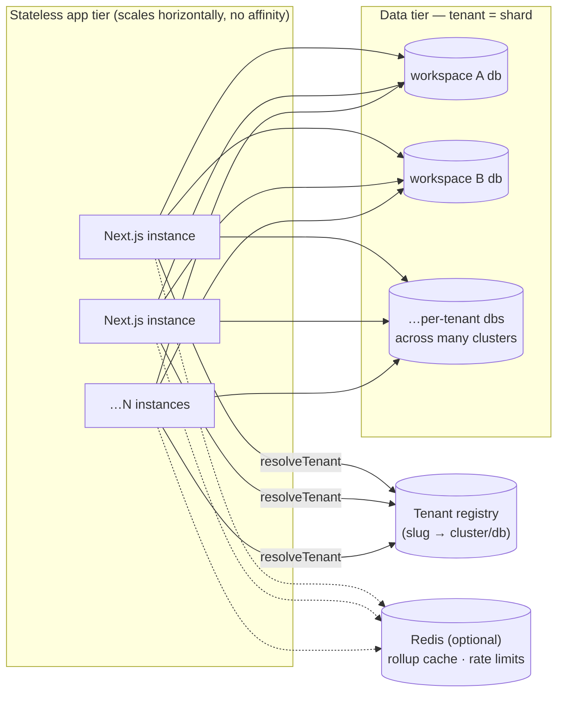

# Scaling Pragati

How this codebase grows from one workspace to, in the limit, billions of
users — and, just as importantly, **in what order**. Every tier below is a
set of levers, most of them already built and dormant. The guiding rule:

> **The unit of scale is the workspace (tenant).** No query, cache key, or
> permission check ever spans tenants. That single invariant is what makes
> horizontal growth a routing problem instead of a rewrite.

## Why this shape scales

Three properties carry all the weight:

1. **The app tier is stateless.** Sessions live in a signed httpOnly JWT;
   per-instance state (rate-limit buckets, session micro-cache) is an
   optimization, never a correctness requirement. Any number of instances
   can serve any request — on Vercel today, on containers/K8s tomorrow,
   with zero code change.
2. **The data tier shards naturally by tenant.** `src/models/Tenant.ts` +
   `src/lib/tenants.ts` already model a registry (slug, custom domain,
   `connectionUri`, `dbName`, quotas) and per-request tenant resolution,
   dormant behind `PRAGATI_MULTI_TENANT`. A tenant's whole world fits in
   one database, so cross-shard queries never exist by construction.
   "Billions of users" decomposes into "millions of tenants × hundreds of
   users", each shard boring and small.
3. **Visibility is a flag, not a list.** `getLeadScope` expresses an
   admin's all-seeing scope as `unrestricted: true` — never as an
   enumerated array of every team/member id spread into `$in` clauses.
   Restricted scopes enumerate only the viewer's own teams (small by
   definition). Per-request work stays O(viewer), not O(workspace).

## What breaks first, and the lever that fixes it

| Pressure point | Breaks at (order of magnitude) | Lever | Status |
| --- | --- | --- | --- |
| Session check: 1 User read per authed request | ~10⁶ requests/day on a small cluster | `SESSION_CACHE_TTL_MS` per-instance micro-cache (≤60s, failure-safe — see below) | **Built, default off** |
| Hot rollups (dashboard, projects, people) recomputed per request | ~10³ concurrent users | Upstash Redis read-through (`src/lib/cache.ts`) — activates with 2 env vars, no-op without | **Built, env-gated** |
| Rate-limit state per instance | many instances / multi-region | swap `src/lib/rateLimit.ts` internals for Upstash Ratelimit — same signature, call sites untouched | Documented seam |
| One DB for all tenants | ~10²–10³ orgs | `PRAGATI_MULTI_TENANT=true` + registry rows; each org → own db/cluster | **Modeled, dormant** |
| Digest cron fans out in one invocation | ~10⁴ recipients | batch by tenant; each tenant's digest is an independent job (the send path is already testable/pure) | Documented seam |
| Unbounded collections (audit log, done tasks) | years of history | TTL/archive tiering: audit → cold storage after N months; `completedAt` queries already window to ≤120 days | Indexes shipped; archival documented |
| Dashboard task load per workspace | ~10⁴ open tasks in ONE workspace | already capped (`.limit(500)`), people panel capped at 500; pagination is the next step | Caps shipped |

## The tiers

### Tier 0 — today (≤ ~1k users, one workspace, $0)
Vercel serverless (pinned co-located with Atlas), Atlas free/M10, pooled
cached connections (`maxPoolSize: 25`, fail-fast timeouts), per-request
session reads, in-memory rate limits. Nothing to do.

### Tier 1 — busy workspace (≤ ~50k users, still $0–low)
Flip three env switches, deploy nothing new:
- `UPSTASH_REDIS_REST_URL/TOKEN` → rollup cache on (read-through, silent
  fallback to DB on any cache failure).
- `SESSION_CACHE_TTL_MS=15000` → session reads drop by ~the cache hit rate.
  Tradeoff, by design: a force-logout/deactivation can take up to 15 extra
  seconds to bite on instances holding a warm entry (the mutating instance
  busts its own cache immediately). The cache can never falsely log a user
  out: any failed validation against cached data re-checks the DB before
  rejecting.
- Atlas tier up; indexes are already compound-matched to the hot
  aggregations (see `src/models/Task.ts`).

### Tier 2 — many organisations (≤ ~5M users)
- `PRAGATI_MULTI_TENANT=true`; seed the Tenant registry. Each org gets its
  own database (same cluster at first, then spread across clusters by
  moving the `connectionUri` per tenant — a data migration per tenant, no
  schema change, no downtime for other tenants).
- Rate limits + caches move to Redis (per-tenant key prefixes are already
  the convention: `pragati:` namespace).
- The master-admin role activates for provisioning; per-tenant quotas
  (`userQuota`, `projectQuota`) enforce blast radius.

### Tier 3 — the "must scale to billions" posture
At this tier the architecture stays, the packaging changes:
- **Registry becomes the shard map.** Millions of tenant rows, cached
  aggressively (tenants change rarely), routing each request to one of
  many Mongo clusters/regions. Tenants are placeable near their users.
- **Service seams follow the existing lib boundaries.** Auth
  (`lib/auth`), audit (`lib/audit`), digest workers, and exports are
  already behind narrow interfaces; they extract into separate deployables
  without touching route handlers.
- **Derived views stop being computed on read.** The dashboard builders
  (`lib/leadDashboard`, `lib/projectList`) become incrementally-maintained
  materialized views (update on write, read precomputed) — the read-through
  cache is the stepping stone to that.
- **Append-only data tiers out.** Audit logs and completed-task history
  move to cold storage after a retention window; the live db holds the
  working set.
- What stays untouched: the permission matrix, the visibility flag rule,
  the JWT session model, every route handler's shape.

## Rules that keep us scalable (enforced in review)

1. Never spread a workspace-sized id list into a query — branch on
   `scope.unrestricted` instead (`lib/leadScope.ts` documents this).
2. Every list endpoint has a cap or a cursor. No `find({})` without
   `.limit()` on a growing collection.
3. New query shapes ship with their compound index in the model file,
   commented with the caller they serve.
4. Caches are read-through, namespaced, and safe to lose; the DB is always
   authoritative. Nothing security-relevant is ever *only* in a cache.
5. Per-tenant everything: keys, quotas, connections. If a feature needs a
   cross-tenant query, the design is wrong.

## Honest limits

- One *single* workspace with hundreds of thousands of members would need
  pagination work (People directory, dashboard people panel) beyond the
  current caps — the architecture assumes orgs decompose into teams.
- The bird's-eye SVG renders every visible node; trees beyond ~1–2k nodes
  need virtualization (collapse-by-default already mitigates).
- MongoDB free-tier connection limits bound Tier 0 concurrency (~25
  pooled connections per instance is tuned for this).
